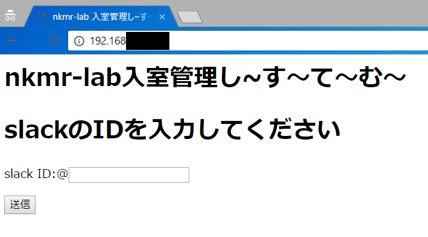
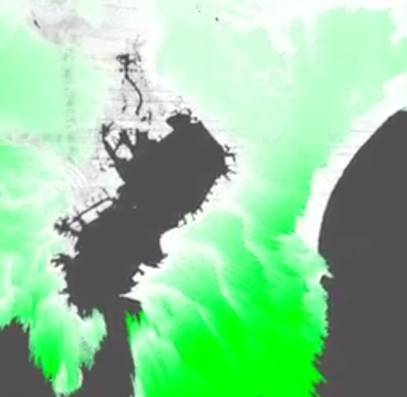
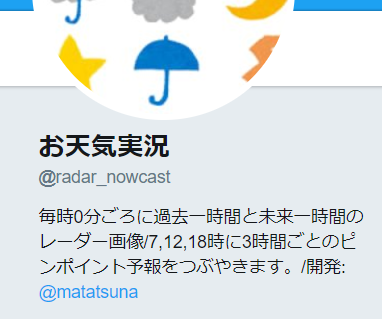
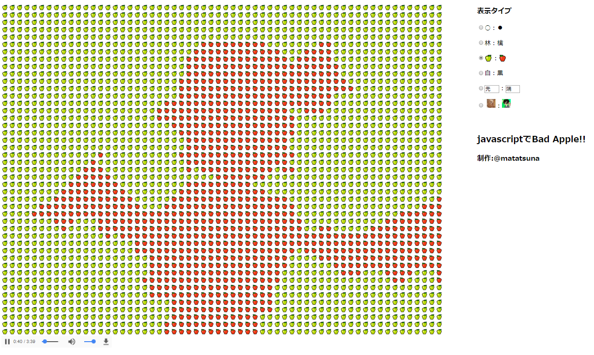
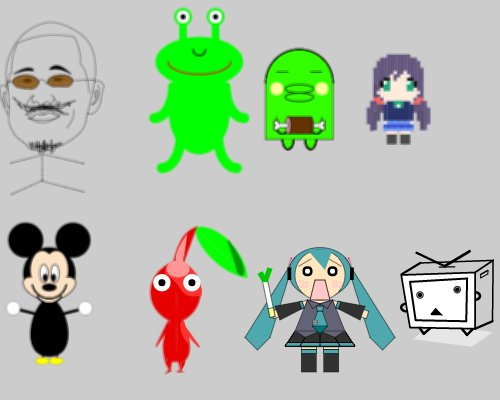
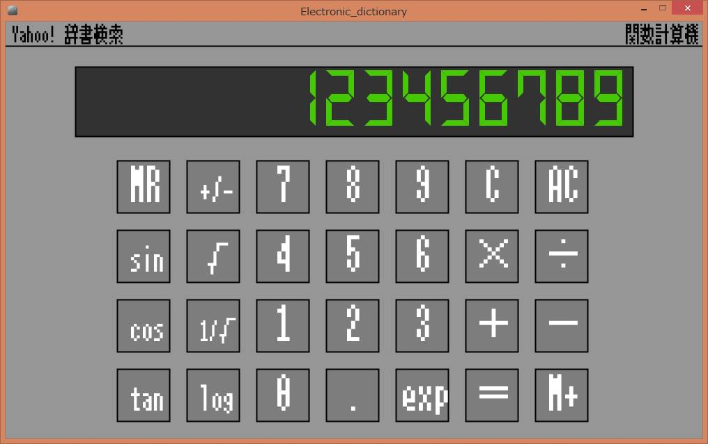

# 作品紹介

## 研究室に誰がいるか?
研究室に誰がいるかをslackから確認するシステムを作った
[はてなブログ](http://matatsuna.hatenablog.com/entry/2017/04/17/120534)

## 彼女はWebだが役に立つ
あなたの彼女はWebの中にいる！？あなたも、バーチャル彼女のみくりと充実した日々を送ろう！
[はてなブログ](http://matatsuna.hatenablog.com/entry/2017/01/31/121526)

## 日本地図3Dビュワー
日本地図を3D表示行うビュワー
[はてなブログ](http://matatsuna.hatenablog.com/entry/2017/01/31/151847)

## お天気実況bot
ゲリラ豪雨などを検知するため毎時の天気図をお届けするbot
[gimmick:TwitterFollow](@radar_nowcast)

## javascriptでBadApple!!
[はてなブログ](http://matatsuna.hatenablog.com/entry/2016/10/19/151337)
[javascriptでBadApple!!](http://matayoshi.nkmr.io/js/badapple/)

## pictureAlive
processingを使ってweb上で画像を加工してTwitterで画像とソースコードを共有できるwebツール
[はてなブログ](http://matatsuna.hatenablog.com/entry/2016/06/28/113808)
[pictureAlive](http://wada.nkmr.io/pictureAlive/)

## pictureadd
どんな文章にも関連した画像を付けてツイートをするwebツール
[はてなブログ](http://matatsuna.hatenablog.com/entry/2016/06/24/110705)
[pictureadd](http://pictureadd.azurewebsites.net)

## pinhashtag
ハッシュタグを固定してツイートをするwebツール
[はてなブログ](http://matatsuna.hatenablog.com/entry/2016/06/15/005523)
[pinhashtag](http://pinhashtag.azurewebsites.net)

## 一次元バーコードジェネレータ
13ケタの一次元バーコードを作成するツール
[はてなブログ](http://matatsuna.hatenablog.com/entry/2016/05/03/232514)
[一次元バーコードジェネレータ](http://matayoshi.nkmr.io/php/barcode/)

## StreamLine
Twitterのツイートを分析し類似した歌詞を持つ曲を提案し、感情抽出を行いSongleを用いて曲をアレンジするソフトウェア
[はてなブログ](http://matatsuna.hatenablog.com/entry/2016/01/30/160001)

## あの花のEDで音ゲー
[はてなブログ](http://matatsuna.hatenablog.com/entry/2015/10/14/001405)

##PiPoPaPoPi
DTMFを用いたURL送受信システム
[はてなブログ](http://matatsuna.hatenablog.com/entry/2015/08/22/045450)

## 電卓辞書
P演習1で、電卓と辞書を作った
[はてなブログ](http://matatsuna.hatenablog.com/entry/2015/08/03/020713)

## matamata
EP演習で発表したMATAMATAの公開版のフルーツツムツム
[はてなブログ](http://matatsuna.hatenablog.com/entry/2015/10/28/185413)
[matamata2](http://matamata.azurewebsites.net)

