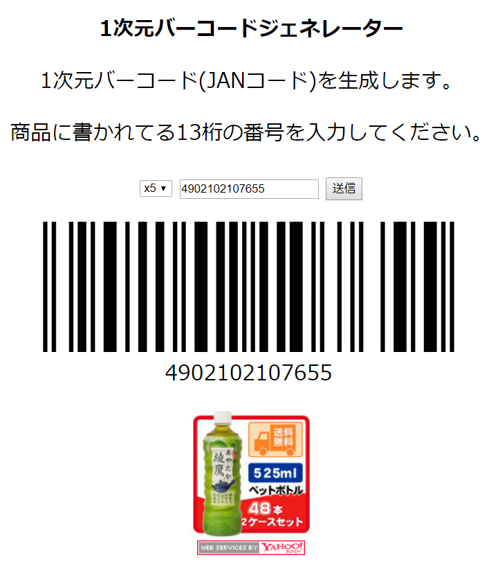

# 作品紹介

## codePrint
ハイライト付きでソースコードを印刷
[Github](https://github.com/matatsuna/codeprint)
[はてなブログ](https://matatsuna.hatenablog.com/entry/2018/10/14/225715)
[codePrint](https://service.matatsuna.net/codeprint/)

## pdf2gyazo
PDFからGyazoに変換！
[Github](https://github.com/matatsuna/pdf2gyazo)
[はてなブログ](http://matatsuna.hatenablog.com/entry/2018/02/04/014139)
[pdf2gyazo](https://pdf2gyazo.azurewebsites.net/)

## WISS - Wave Impression Search System
手書き波形で音楽を検索するシステム `Songleハッカソン研究者賞`
[WISS2017](http://matayoshi.nkmr.io/work/WISS2017/)

## GPSNS
地図に位置情報付き写真をマッピングするシステム
[GPSNS](https://service.matatsuna.net/gpsns)

## tourismMap
日本地図に観光地情報をマッピングするシステム
[Github](https://github.com/matatsuna/tourismMap)
[tourismMap](https://tourism.matatsuna.net/)

## weatherMap
日本地図に2008年の降雨情報をマッピングするシステム 
[Github](https://github.com/matatsuna/weatherMap)
[wheatherMap](http://weather.matatsuna.net/)

## PinchInOut
Googleマップのピンチインとピンチアウトの再実装
[Github](https://github.com/matatsuna/PinchInOut)

## affineTranslation
図形を目的の位置や形、大きさに調節し素早く近づけるゲーム
[Github](https://github.com/matatsuna/affineTranslation)

## 研究室に誰がいるか?
研究室に誰がいるかをslackから確認するシステムを作った
[はてなブログ](http://matatsuna.hatenablog.com/entry/2017/04/17/120534)

## 彼女はWebだが役に立つ
あなたの彼女はWebの中にいる！？あなたも、バーチャル彼女のみくりと充実した日々を送ろう！
[はてなブログ](http://matatsuna.hatenablog.com/entry/2017/01/31/121526)

## 日本地図3Dビュワー
日本地図を3D表示行うビュワー
[はてなブログ](http://matatsuna.hatenablog.com/entry/2017/01/31/151847)

## お天気実況bot
ゲリラ豪雨などを検知するため毎時の天気図をお届けするbot
[Github](https://github.com/matatsuna/radar_nowcast)
[gimmick:TwitterFollow](@radar_nowcast)

## TableタグのCSSでBadApple!!
サクサク軽量版のBadApple芸
[Github](https://github.com/matatsuna/badapple)
[TableタグのCSSでBadApple!!](https://service.matatsuna.net/badapple/)

## javascriptでBadApple!!
【注意！】ハイスペックの機器で実行しないと停止する恐れがあります。
[はてなブログ](http://matatsuna.hatenablog.com/entry/2016/10/19/151337)
[javascriptでBadApple!!](https://service.matatsuna.net/badapple-old/)

## pictureAlive
processingを使ってweb上で画像を加工してTwitterで画像とソースコードを共有できるwebツール
[はてなブログ](http://matatsuna.hatenablog.com/entry/2016/06/28/113808)
[pictureAlive](https://nkmr.io/picturealive/)

## pictureadd-songle
pictureaddを使って音楽動画の歌詞を画像検索して表示
[pictureadd-songle](https://service.matatsuna.net/pictureadd-songle)

## pictureadd
どんな文章にも関連した画像を付けてツイートをするwebツール
[はてなブログ](http://matatsuna.hatenablog.com/entry/2016/06/24/110705)
[pictureadd](https://pictureadd.matatsuna.net)

## pinhashtag
ハッシュタグを固定してツイートをするwebツール
[はてなブログ](http://matatsuna.hatenablog.com/entry/2016/06/15/005523)
[pinhashtag](https://service.matatsuna.net/pinhashtag)

## 一次元バーコードジェネレータ
13ケタの一次元バーコードを作成するツール
[はてなブログ](http://matatsuna.hatenablog.com/entry/2016/05/03/232514)
[一次元バーコードジェネレータ](https://service.matatsuna.net/barcode/)

## StreamLine
Twitterのツイートを分析し類似した歌詞を持つ曲を提案し、感情抽出を行いSongleを用いて曲をアレンジするソフトウェア
[はてなブログ](http://matatsuna.hatenablog.com/entry/2016/01/30/160001)

## あの花のEDで音ゲー
[はてなブログ](http://matatsuna.hatenablog.com/entry/2015/10/14/001405)

## PiPoPaPoPi
DTMFを用いたURL送受信システム
[はてなブログ](http://matatsuna.hatenablog.com/entry/2015/08/22/045450)

## 電卓辞書
P演習1で、電卓と辞書を作った
[はてなブログ](http://matatsuna.hatenablog.com/entry/2015/08/03/020713)

## matamata
EP演習で発表したMATAMATAの公開版のフルーツツムツム
[はてなブログ](http://matatsuna.hatenablog.com/entry/2015/10/28/185413)
[matamata2](http://matamata.azurewebsites.net)

